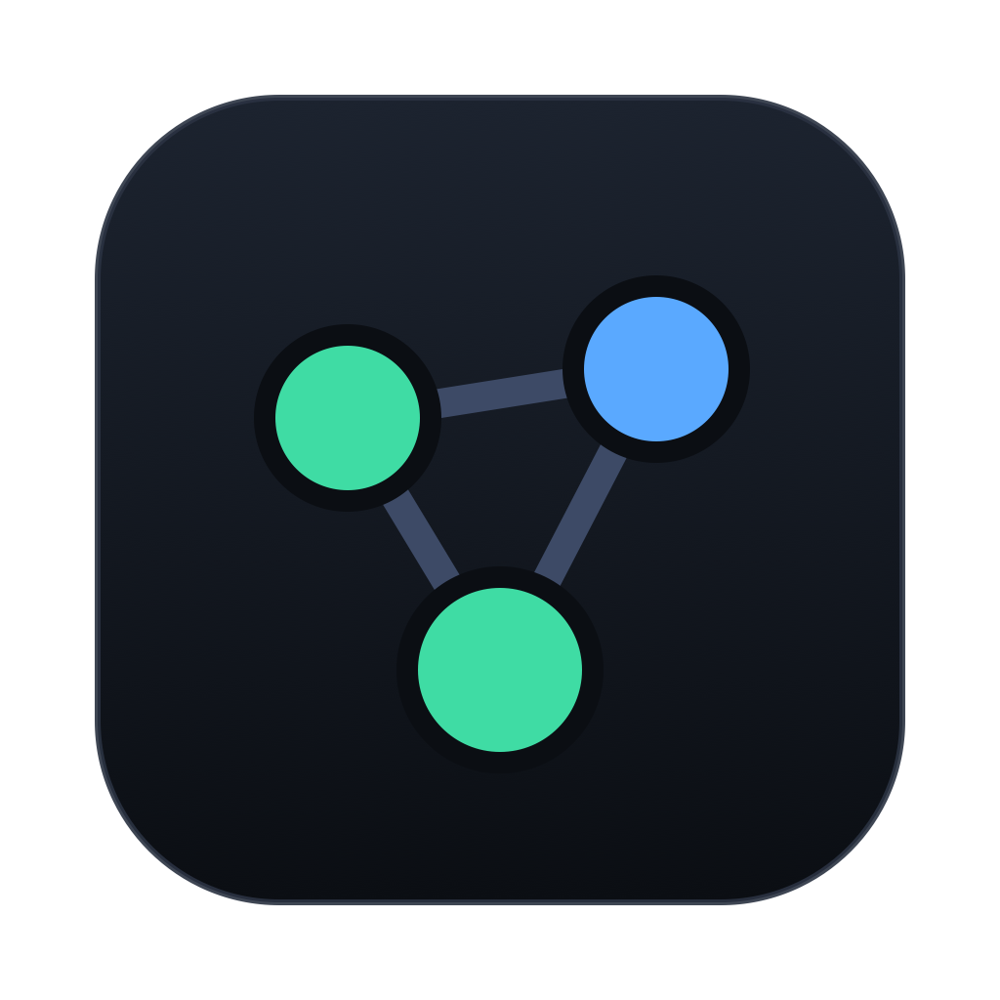
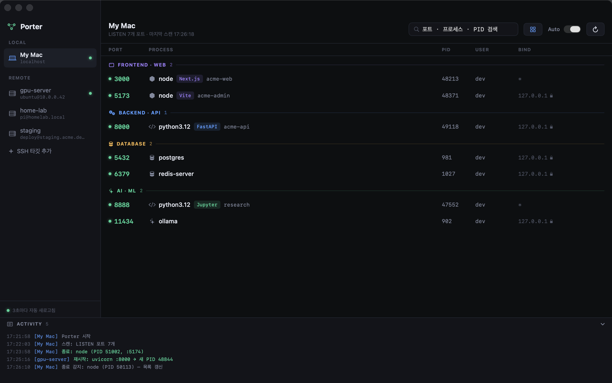
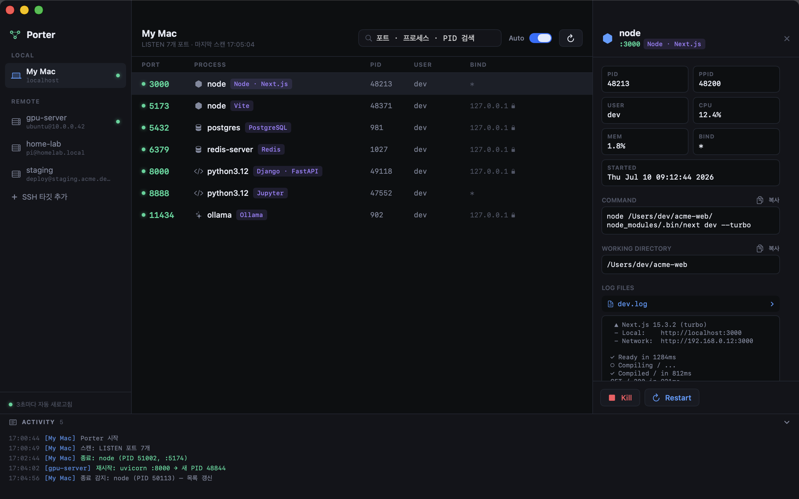
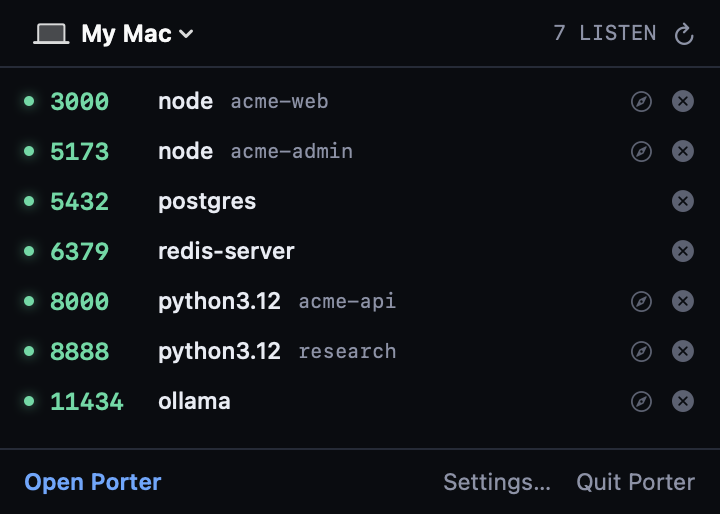

<p align="center">
  
</p>

<h1 align="center">Porter</h1>

<p align="center">
  개발자를 위한 macOS 네이티브 프로세스·포트 매니저 —<br>
  로컬 Mac과 <b>SSH 원격 서버</b>의 개발 서버를 한 창에서 모니터링하고 안전하게 제어합니다.
</p>

<p align="center">
  <a href="../README.md">English</a> · <b>한국어</b> · <a href="README.ja.md">日本語</a>
</p>

<p align="center">
  
  
  
  <a href="https://github.com/Goodtail/porter/releases/latest"></a>
  
  
</p>



`lsof -i :3000` → `ps aux | grep` → `kill -9` → 재확인… 이 조합을 로컬에서도,
SSH로 접속한 GPU 서버에서도 반복하고 있다면 — Porter는 그 전체 흐름을 클릭
몇 번으로 줄입니다. 원격 머신도 **localhost와 완전히 동일한 UX**로 다룹니다.

## 주요 기능

- **포트 스캔** — 선택한 타깃(로컬/SSH)의 LISTEN 중인 TCP 포트 전체를
  프로세스명·PID·사용자·바인드 주소와 함께 표시. 로컬 3초 / 원격 6초 폴링
- **메뉴 막대 퀵 패널** — Porter가 메뉴 막대에 상주. 창을 닫아도 LISTEN 포트를
  한눈에 확인하고 클릭 한 번으로 kill. 로그인 시 자동 실행 등은 설정(⌘,)에서
- **개발 포트 인텔리전스** — 3000(Next.js), 5173(Vite), 8000(Django/FastAPI),
  8888(Jupyter), 11434(Ollama), 5432(PostgreSQL) 등 잘 알려진 포트에 라벨 표시
- **프로젝트 식별** — 각 프로세스의 작업 디렉토리에서 `package.json`,
  `pyproject.toml`, `go.mod`, `Cargo.toml` 등을 읽어 이 서비스가 실제로 무엇인지
  표시: `Next.js · acme-web`, `NestJS · pind-api`. SSH에서도 전체 프로세스를
  **배치 스크립트 1회 왕복**으로 처리
- **카테고리 섹션** — FRONTEND · BACKEND · DATABASE · AI/ML · OTHER로
  목록 자동 그룹핑 (토글 가능)
- **브라우저 바로가기** — 클릭 한 번으로 `http://localhost:3000` 열기.
  머신(로컬/원격)에서 Tailscale이 감지되면 tailnet URL도 함께 제공 —
  GPU 서버의 dev 서버를 어떤 기기에서든 한 번에 접속
- **"이 포트 비어있나?"** — 검색창에 포트 번호를 입력하면 점유 프로세스를
  찾아주거나, 비어 있으면 "사용 가능"을 명시
- **프로세스 인스펙터** — 전체 실행 명령어와 작업 디렉토리(복사 버튼),
  CPU/MEM, 시작 시각, 열려 있는 로그 파일 자동 감지 + tail 미리보기
- **라이브 로그 스트리밍** — 감지된 로그 파일을 실시간으로 follow (`tail -F`,
  로컬/SSH 동일). Porter로 재시작한 프로세스는 출력이 `~/.porter/logs/`에
  기록되어 — 터미널에만 로그를 쓰던 프로세스도 즉시 스트리밍 가능
- **실행 이력** — kill/재시작 시 전체 명령어·작업 디렉토리·포트·타깃을
  프로세스가 죽기 *전에* 스냅샷. 시계 버튼에서 목록 확인, 클릭 한 번으로 재실행 —
  "그 명령어가 뭐였더라"를 다시 찾을 필요 없음
- **리스트 favicon** — URL 칼럼에 각 서비스 주소와 함께, 떠 있는 서비스에서
  직접 가져온 favicon 표시 (`/favicon.ico`, 폴백은 홈페이지 `<link rel=icon>`).
  클릭하면 열림
- **다른 포트로 이동** — 재시작 시트의 PORT 필드에 새 포트를 입력하면
  명령어의 `--port 3000` / `-p 3000` / `PORT=3000`을 자동 재작성(없으면
  `PORT=` 접두)하고 결과를 보여준 뒤 재기동 — "3000 점유 중이니 3001로"가
  버튼 하나



- **안전한 Kill** — 확인 시트에 *무엇을 어디서* 죽이는지(타깃, PID, 포트, 전체
  명령어) 항상 표시. SIGTERM → 생존 확인 → 실패했을 때만 SIGKILL 노출.
  root/시스템 프로세스는 추가 체크박스 확인 필요
- **Restart** — 기록된 작업 디렉토리에서 같은 명령어로 재기동 (실행 전 수정 가능)
- **SSH 네이티브** — `~/.ssh/config`의 호스트 자동 인식, 기존 키/agent 그대로
  사용. 서버가 비밀번호를 요구하면 앱 내에서 물어보고(메모리 보관, Keychain
  저장은 opt-in) ControlMaster로 인증된 연결을 재사용. 원격에 에이전트 설치
  불필요 — `lsof`/`ss`/`ps`만 있으면 동작
- **푸시 기반 종료 감지** — 표시 중인 로컬 PID를 kqueue로 감시. dev 서버가
  죽는 순간 폴링 주기와 무관하게 UI 즉시 갱신
- **Activity Feed** — 모든 스캔/킬/재시작을 시간순 기록.
  "아까 내가 뭘 죽였지?"에 항상 답할 수 있음

## 메뉴 막대에서 바로



창을 전환할 필요 없이, 메뉴 막대의 Porter 아이콘을 클릭하면 어떤 타깃이든
LISTEN 중인 포트가 한눈에 — 폭주하는 dev 서버는 클릭 한 번으로 kill.
메인 창을 닫아도 Porter는 백그라운드에서 계속 지켜봅니다.

## 설치

### Homebrew

```bash
brew install --cask goodtail/tap/porter
```

### 설치 스크립트

```bash
curl -fsSL https://raw.githubusercontent.com/Goodtail/porter/main/Scripts/install.sh | sh
```

### 직접 다운로드

**[Releases](https://github.com/Goodtail/porter/releases/latest)**에서 DMG를 받아
Porter를 Applications에 끌어다 놓으세요. 실행 시 릴리스 피드를 확인해(Sparkle)
새 버전이 나오면 클릭 한 번으로 업데이트됩니다.

> 1.0 이전 빌드는 아직 공증 전이라 첫 실행 시 macOS 경고가 뜹니다. 설치
> 스크립트는 격리 플래그를 자동으로 해제하며, Homebrew는 `--no-quarantine`
> 옵션을 쓰거나 시스템 설정 → 개인정보 보호 및 보안에서 허용하면 됩니다.

### 소스 빌드

macOS 14+ 및 Xcode Command Line Tools(Swift 6) 필요.

```bash
git clone https://github.com/Goodtail/porter.git && cd porter

# 바로 실행
swift run

# 또는 배포 가능한 앱 번들 생성 (dist/Porter.app, ad-hoc 서명)
./Scripts/make-app.sh
```

### 헤드리스 CLI 스캔

GUI 없이 같은 스캔 엔진 사용:

```bash
.build/release/Porter --scan              # 로컬 스캔
.build/release/Porter --scan gpu-server   # ~/.ssh/config의 호스트 스캔
```

### 데모 모드

`swift run Porter --demo` — 실제 프로세스 노출 없이 큐레이션된 가짜 데이터로
UI를 둘러보거나 스크린샷을 찍을 때 유용합니다.

## 동작 원리

```
사이드바(타깃) │ 포트 리스트 │ 인스펙터        ← SwiftUI, 다크 전용 3-패널
                AppState (@MainActor)
        ┌───────── Scan/Control Engine ─────────┐
        │ Scanner : 스크립트 생성 + 파서          │  로컬/원격이 같은 코드 경로.
        │ Runner  : LocalRunner (zsh)            │  실행기만 교체됩니다.
        │           SSHRunner (시스템 ssh)        │
        └────────────────────────────────────────┘
```

- 포트 스캔: `lsof -nP -iTCP -sTCP:LISTEN -F…` (머신 파싱 모드 — 공백 포함
  프로세스명 안전). lsof 없는 Linux 서버는 `ss -ltnp` 자동 폴백
- 상세 조회: ps + lsof(cwd/로그)를 마커로 구분한 **단일 스크립트 1회 왕복** —
  SSH 레이턴시를 한 번만 지불
- 갱신 전략: 소켓 목록은 스냅샷 폴링(유일한 이식 가능한 방법)이 기본이되,
  로컬 PID는 kqueue `NOTE_EXIT` 푸시로 보강하고, 창이 가려지면 폴링을 멈추며,
  로컬 3초/원격 6초로 차등 적용
- 비밀번호는 `SSH_ASKPASS` 헬퍼를 통해 환경 변수로만 ssh에 전달 — 명령줄·디스크
  노출 없음. 키 전용 서버(`Permission denied (publickey)`)에는 물어보지 않음

## 안전 모델

- Kill 확인 시트에 타깃/프로세스/PID/포트/전체 명령어 항상 표시 —
  "엉뚱한 PID를 죽였다" 사고 방지
- SIGKILL은 SIGTERM 실패가 확인된 뒤에만 노출되는 2차 수단
- 휴리스틱 보호: root 소유, 시스템 경로(`/System`, `/usr/libexec` 등),
  낮은 PID는 경고 배지 + 명시적 확인 체크박스
- Keychain 저장을 선택하지 않는 한 비밀번호를 저장하지 않음

## 개발

```bash
swift test                             # 파서·인증 단위 테스트
./Scripts/make-icons.sh                # 플랫 아이콘 에셋 재생성
swift run Porter --screenshot docs     # README 스크린샷 재생성 (데모 데이터)
```

기여 환영합니다 — 이슈나 PR을 열어주세요.

## 로드맵

- v0.2 — 메뉴바 모드, 프로세스 그룹 재기동, 로그 스트리밍, 다국어 지원
- v0.3 — tmux 세션 뷰, Docker 컨테이너 인식, 공증(notarized) 릴리스

전체 제품 스펙은 [PRD.md](../PRD.md) 참고.

## 라이선스

[MIT](../LICENSE)
